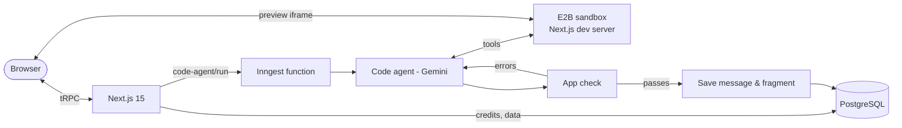

<div align="center">


# Craafter

**AI Web App Builder with Live Cloud Sandboxes**

Describe an app in plain English, watch an AI agent build it in a cloud sandbox, then preview it, read the code, and keep iterating by chat.

[](https://nextjs.org/)
[](https://www.typescriptlang.org/)
[](https://agent-kit.inngest.com/)
[](https://ai.google.dev/)
[](https://e2b.dev/)

</div>

## Demo

https://github.com/user-attachments/assets/15be73a8-62a1-4906-ba56-25ecc00097df

The agent building a kanban board, the app check catching a bug and the agent fixing it, and a follow-up edit.

## Features

- **AI coding agent** (`@inngest/agent-kit` + Gemini) builds a Next.js 15 + Tailwind + shadcn/ui app inside an isolated **E2B** sandbox, using terminal, file write, `editFile` and file read tools.
- **App check before every result**: pages are rendered and parsed, then tested in headless Chromium against acceptance checks the agent writes (`craafter.checks.json`) plus a smoke test that clicks through the app. Mechanical errors are fixed without the model, the rest go back to the agent (up to 3 rounds), and a fix that makes things worse is rolled back.
- **Follow-ups** continue from the latest version and change existing files only through targeted edits.
- **Live preview and code explorer**, with a **Fix it** button for errors thrown in the preview and live status while the agent works.
- **Credits**: Free 5 / Pro 100 per 30 days (Clerk Billing). Failed or still-broken generations are refunded.
- **Model fallback**: switches to Groq when Gemini runs out of quota.

## Architecture


```mermaid
flowchart LR
    User([Browser]) <-->|tRPC| App[Next.js 15]
    App -->|credits, data| DB[(PostgreSQL)]
    App -->|code-agent/run| Inngest[Inngest function]
    Inngest --> Agent[Code agent - Gemini]
    Agent <-->|tools| Sandbox[E2B sandbox<br/>Next.js dev server]
    Agent --> Check[App check]
    Check -->|errors| Agent
    Check -->|passes| Save[Save message & fragment]
    Save --> DB
    User <-->|preview iframe| Sandbox
```

## Tech Stack

Next.js 15 (App Router, React 19) · TypeScript · Tailwind CSS v4 · shadcn/ui · tRPC v11 · TanStack Query · Inngest + agent-kit · Google Gemini (Groq fallback) · E2B · Playwright · Prisma + PostgreSQL · Clerk · rate-limiter-flexible

## Getting Started

Requirements: Node.js 20+, PostgreSQL (e.g. [Neon](https://neon.tech)), and keys for [Gemini](https://aistudio.google.com/apikey), [E2B](https://e2b.dev/) and [Clerk](https://clerk.com/) (with Billing plans `free_user` and `pro`).

```bash
git clone https://github.com/<your-username>/craafter.git
cd craafter
npm install                # also applies patches/ and generates the Prisma client
cp .env.example .env       # fill in the keys
npx prisma migrate deploy
npm run dev                # http://localhost:3000
npm run dev:inngest        # second terminal, dashboard at http://localhost:8288
```

### Environment Variables

Required: `NEXT_PUBLIC_APP_URL`, `DATABASE_URL`, `GEMINI_API_KEY`, `E2B_API_KEY`, `NEXT_PUBLIC_CLERK_PUBLISHABLE_KEY`, `CLERK_SECRET_KEY`, the Clerk sign-in/sign-up URLs, and `INNGEST_DEV=1` locally (`INNGEST_EVENT_KEY` and `INNGEST_SIGNING_KEY` in production).

Optional: model overrides (`GEMINI_CODE_MODEL`, `GEMINI_SUMMARY_MODEL`, `GEMINI_FIX_MODEL`, `GEMINI_REVIEW_MODEL`), the Groq fallback (`GROQ_API_KEY`, `GROQ_ROLES`, `PROVIDER_COOLDOWN_MINUTES`) and `CODE_AGENT_FIX_ATTEMPTS` (default 3). See `.env.example` for descriptions.

### Custom Sandbox Template

The app uses the E2B template `craafter-nextjs-v3` (2 vCPU, 2 GB RAM). To build your own from `sandbox-templates/nextjs`:

```bash
e2b template create your-template-name --dockerfile e2b.Dockerfile --cmd "/compile_page.sh" \
  --ready-cmd "curl -s -o /dev/null -w '%{http_code}' http://localhost:3000 | grep -q 200" \
  --memory-mb 2048 --cpu-count 2
```

Then change the name in `Sandbox.create(...)` in `src/inngest/functions.ts`.

## Project Structure

```text
src/
├── app/            # Pages and the /api/trpc and /api/inngest routes
├── inngest/        # Agent function, tools, app check, models and fallback
├── modules/        # tRPC routers and UI for home, projects, messages, usage
├── prompt.ts       # Agent system prompts
└── lib/            # Prisma client, credits
prisma/             # Schema and migrations
sandbox-templates/  # E2B sandbox image
patches/            # Fixes for @inngest/agent-kit (Gemini 3) and rate-limiter-flexible
```

## Known Limitations

- Previews stop working when the sandbox shuts down, 30 minutes after the last activity. The code stays viewable.
- Generated apps are frontend only (static/local data).
- Gemini free-tier keys allow few requests per day; one generation uses about 8–20.
- The app check catches most problems but can't prove an app correct.
